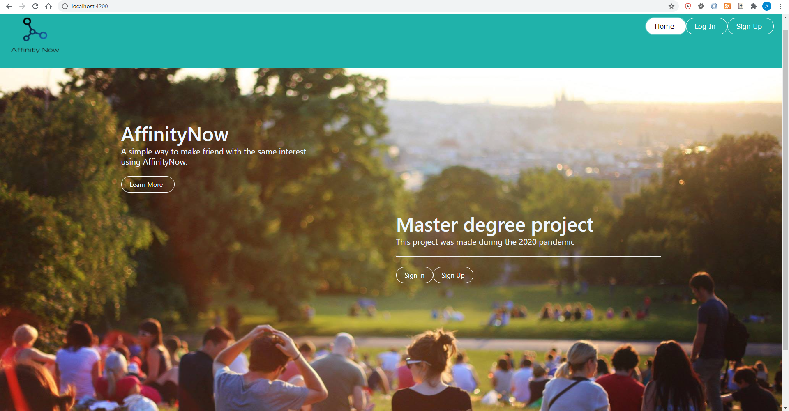
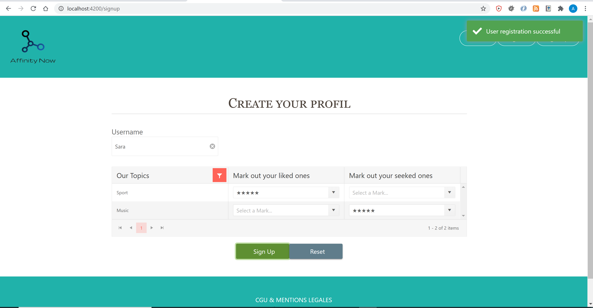

## AffinityNow

AffinityNow is a free communication app inspired by messaging & social media apps.
Written in JAVA 14 (back) and Angular 11 (Front).

### Screenshots

 

### Features
   * Create user profile (Username)
   * Match people based on mutual interest 
   * Authentication and choosing match method
   * managing your friend list
   * managing your profil
   * Search users by Username
   * Send messages by email
     ......coming next
   * Check message read/delivery status
   * Take a picture from camera or gallery
   * Display graphics in full screen view, zoom in/out, drag and rotate
   * Check user online status
   * Get notifications about new messages

### Downloading

Click on the links below to download owr fun App 😄

### Authors
* **Chakir Ardenne** - *Master 1 Devops project* - [Github Account](https://github.com/ChakirArdenne)
* **Avi Assayag** - *Master 1 Devops project* - [Github Account](https://github.com/AssayagAvi)
* **Erwyn Ramin** - *Master 1 Devops project* - [Github Account](https://github.com/Ramin-Erwyn)
* **Ahlem Fantazi** - *Master 1 Devops project* - [Github Account](https://github.com/AhlemFANTA)

See also the list of [contributors](https://github.com/your/project/contributors) who participated in this project.

### Versioning
We use [SemVer](http://semver.org/) for versioning. For the versions available, see the [tags on this repository](https://github.com/AffinityNowFront/AffinityNowFront).

### Bugs / Feature request
Please [report](https://github.com/AffinityNowFront/AffinityNowFront/issues) bugs and feel free to [ask](https://github.com/AffinityNowFront/AffinityNowFront/issues) for new features directly on GitHub.

### License
This project licensed under the Apache License 2.0 - see the [LICENSE.md](LICENSE) file for details
